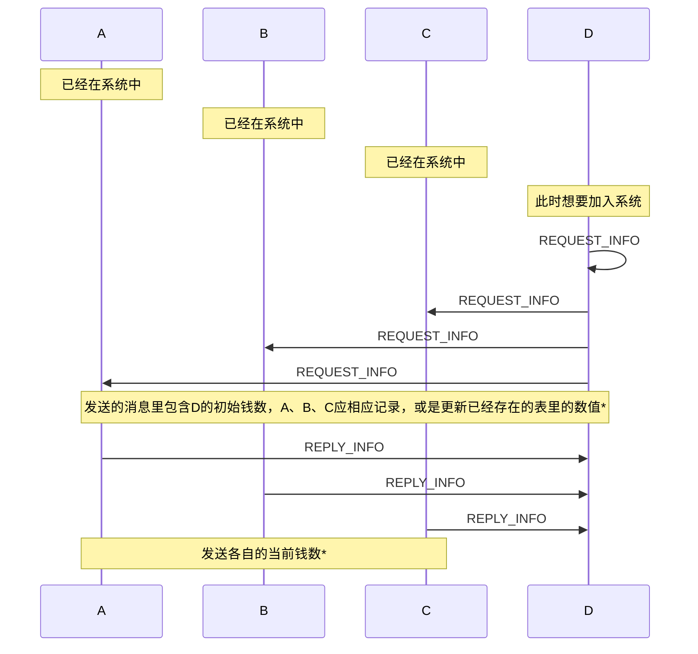
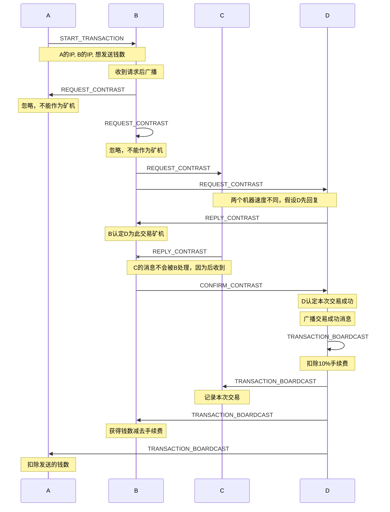

# XinuLabFinal

XINU综合实验——区块链小游戏

## 协议设计

本项目使用结构体二进制传输，定义如下：

```c
typedef struct {
#define BC_VERSION_1 0x80  // 和字符串兼容，> 0x7F
    unsigned char version;  // 协议版本
#define BC_TYPE_START_TRANSACTION 1
#define BC_TYPE_REQUEST_CONTRAST 2
#define BC_TYPE_REPLY_CONTRAST 3
#define BC_TYPE_CONFIRM_CONTRAST 4
#define BC_TYPE_TRANSACTION_SUCCESS 5
#define BC_TYPE_TRANSACTION_BOARDCAST 6
// 用来发现桥接网络里的所有设备IP
#define BC_TYPE_REQUEST_INFO 0x80
#define BC_TYPE_REPLY_INFO 0x81
    unsigned char type;
    unsigned short padding;

    unsigned int sender;
    unsigned int receiver;
    unsigned int amount;  // 仿照银行系统，精确到1分，实际钱数为 amount/100 元
} bc_packet_t;
```

使用version字节，如果大于`0x7F`一定不是ASCII字符，以此和字符串程序区分，后期考虑兼容字符串编码的程序

### 网络流程图

1. peer发现流程图



* 在这个过程中，如果一些设备重启并且重设它们的钱数，和之前记录不符者，本仓库的实现会报warning，但仍然相信它的数值。同时，正常结束程序，会在结尾打印当前钱数，可以用于下次开始程序的输入参数。（这里有很多race condition，比如作为发送者，强行结束程序，会导致自己的钱没有扣，其他人拿到了钱，所以结束程序前最好确保没有正在发送的交易，以及通过`show fsm`打印当前后台进行的交易，如果没有再终止程序。虽然你看的时候没有不代表最终没有.......解决方案是实现一个flag，设置flag以后不再接受新的交易，直到已有的后台交易完成或超时，用户才可以终止程序，这个留作TODO）
* 这里也有race condition，解释同上

2. 交易流程图



### 漏洞与攻击

*本程序尽力审查所有包，报告异常包并尝试分析恶意程序*

1. 钱数没有经过审查，有意甚至不小心重启程序，都将导致钱数的异常变化
2. 如果交易接收者一直不反回消息，发送者无从得知，是否取消交易都会导致risk
3. 不去检查包的源地址，伪造包，甚至伪造IP地址均有可能（在这样一个链路层交换机网络中）
4. 强行修改金钱数不会引起任何问题，别人无从得知一个人的现有钱数目，也无从记录

## 软件设计

为了保证程序的可调试性，在`test`文件夹下面包含一份运行在Linux上面的代码，通过建立namespace模拟多个设备，进行通信。

这部分是程序的接口，当port到XINU上运行时需要仿照实现相应功能

```c
// 获取当前的时间，单位是毫秒
unsigned long long bc_gettime_ms(void);
// 指定ip和端口发送UDP包
int udp_sendpacket(char* buf, unsigned int length, unsigned int remip, unsigned short remport);
// 调用OS的sleep函数，单位是毫秒
void bc_sleep_ms(unsigned int ms);
// 随机数生成 1 ≤ ret ≤ max，收到请求矿机指令时随机延时，这样各个机器都有机会处理请求
unsigned int bc_random(unsigned int max);  // generate 1 ~ max random number
```

## 测试

最终大作业的形式应该是所有Galileo板子桥接到一起，通过一个路由器分配IP。在Linux环境下调试的时候，可以通过namespace建立独立的网络栈，**手动**分配IP地址，然后通过虚拟网桥连接到一起。

```shell
sudo apt install bridge-utils  # 安装控制网桥的程序
```

为了方便，本程序提供一个python脚本`setup_vnet.py`用来设置虚拟网络环境，建议在虚拟机环境下使用，它会删除已有的所有虚拟网络，如果遇到问题可以重启解决。

```shell
python3 setup_vnet.py  # 需要使用python 3.x
```

默认生成的网络为4个namespace：`ns1`、`ns2`、`ns3`、`ns4`，你可以修改python脚本来自定义设置。运行python脚本后成功建立虚拟网络，你可以通过如下命令在某个特定的namespace里执行程序，仿佛在一个独立的主机里一样！

```shell
sudo ip netns exec <namespace> <command>
```

一个例子是查看namespace下的网卡

```shell
$ sudo ip netns exec ns1 ifconfig
veth_ns1  Link encap:Ethernet  HWaddr 56:0c:f7:cf:a5:50  
          inet addr:10.0.0.1  Bcast:0.0.0.0  Mask:255.255.255.255
          inet6 addr: fe80::540c:f7ff:fecf:a550/64 Scope:Link
          UP BROADCAST RUNNING MULTICAST  MTU:1500  Metric:1
          RX packets:73 errors:0 dropped:0 overruns:0 frame:0
          TX packets:9 errors:0 dropped:0 overruns:0 carrier:0
          collisions:0 txqueuelen:1000 
          RX bytes:7786 (7.7 KB)  TX bytes:726 (726.0 B)
```

可以看到确实设置了IP地址，拥有一块网卡。接下来测试ping

```shell
$ sudo ip netns exec ns1 ping 10.0.0.2
PING 10.0.0.2 (10.0.0.2) 56(84) bytes of data.
64 bytes from 10.0.0.2: icmp_seq=1 ttl=64 time=0.077 ms
64 bytes from 10.0.0.2: icmp_seq=2 ttl=64 time=0.045 ms
64 bytes from 10.0.0.2: icmp_seq=3 ttl=64 time=0.052 ms
```

